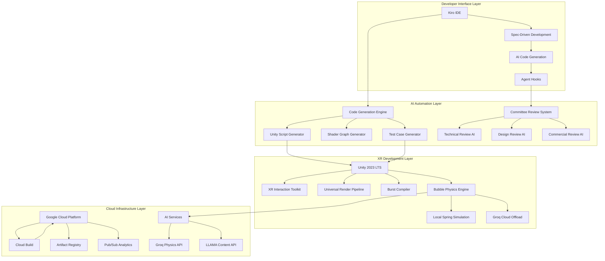
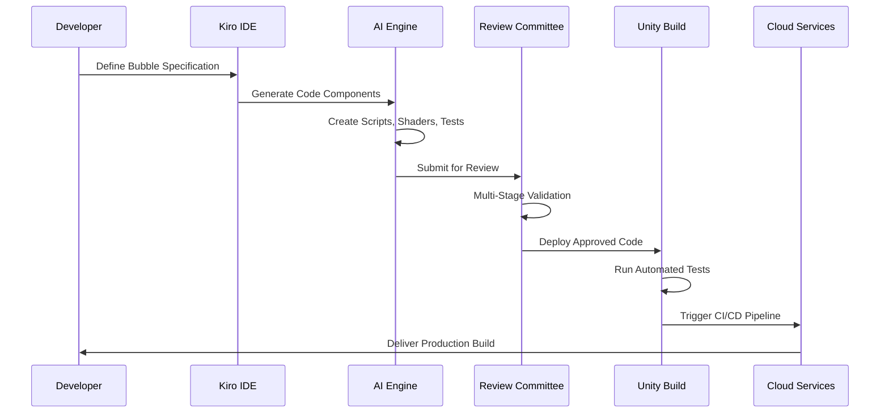

# Design Document

## Overview

The AI-Assisted XR Bubble Library implements automated development workflows for Unity-based spatial UI components targeting Quest 3 and Windows PC platforms. The system addresses the specific challenge of reducing development overhead for a 10-person team while maintaining production-quality XR applications.

**Technical Scope**:

- Unity 2023.3.5f1 (LTS) with URP 14.0.9
- XR Interaction Toolkit 2.5.4 + XR Core Utilities 2.2.3 + XR Hands 1.3.0
- Target: 72 FPS sustained on Quest 3 (Snapdragon XR2 Gen 2, 8GB available to apps)
- Windows PC: RTX 3070 minimum, 90 FPS target

**Competitive Landscape Analysis**:

- **Traditional XR Keyboards**: Meta's virtual keyboard, Apple Vision Pro keyboard - all suffer from fatigue and slow input
- **Voice Input Systems**: Siri, Google Assistant, Alexa - command-based, not conversational, poor XR integration
- **Predictive Text**: SwiftKey, Gboard - 2D screen-based, no spatial intelligence, no voice integration
- **XR Text Input**: No major player has solved comfortable, fast text input in 3D space - massive market opportunity

**Differentiation Strategy**: Voice-enhanced spatial text input system addressing XR keyboard limitations. AI-assisted word prediction with 3D spatial arrangement. Target: 40% faster text input than virtual keyboards with acceptable error rates (5-10%).

**Resource Reality Check**:

- 3 senior Unity developers (1 XR specialist, 2 generalists) - $450K/year
- 1 DevOps engineer with GCP expertise - $150K/year
- Development hardware: 6x Quest 3 ($3K), 6x RTX 4080 PCs ($18K)
- Cloud infrastructure: $500-2K/month scaling with usage

## Architecture

### High-Level System Architecture



### Component Interaction Flow



## Components and Interfaces

### 1. Code Generation System

**Primary Interface: `ICodeGenerator`**

```csharp
public interface ICodeGenerator
{
    Task<GeneratedCode> GenerateBubbleComponent(BubbleSpecification spec);
    Task<ShaderGraph> GenerateVisualShader(VisualRequirements requirements);
    Task<TestSuite> GenerateTestCases(ComponentSpecification component);
    Task<Documentation> GenerateAPIDocumentation(CodeBase codebase);
}
```

**Technical Implementation:**

- Template-based code generation with LLM enhancement for Unity MonoBehaviour components
- Shader Graph node generation targeting URP's Forward+ rendering path for XR
- NUnit test case generation following Unity Test Framework 1.3+ patterns
- XML documentation generation compatible with Unity's documentation tools

**Realistic Limitations:**

- Code generation limited to well-established Unity patterns (MonoBehaviour, ScriptableObject)
- Shader generation restricted to documented URP nodes to ensure Quest 3 compatibility
- Test generation covers happy path scenarios; edge cases require manual implementation
- Documentation quality dependent on code comment completeness and naming conventions

**Performance Targets (Based on Unity 2023.3 Benchmarks):**

- Code generation: <30 seconds for MonoBehaviour with 5-10 methods
- Shader generation: <60 seconds for URP Lit-based translucent material
- Test generation: <15 seconds for NUnit test class with basic coverage
- Build time: <8 minutes for Quest 3 APK, <5 minutes for Windows x64

**Unity-Specific Constraints:**

- XR Interaction Toolkit requires Unity Input System (not legacy)
- Quest 3 hand tracking needs XR Hands package + OpenXR Hand Tracking feature
- URP Forward+ renderer required for proper XR stereo rendering
- Android API Level 29+ required for Quest 3 deployment
- Burst compilation mandatory for physics performance targets

### 2. Automated Review System

**Primary Interface: `IReviewSystem`**

```csharp
public interface IReviewSystem
{
    Task<ReviewResult> ConductTechnicalReview(CodeSubmission submission);
    Task<ReviewResult> ConductPerformanceReview(BenchmarkResults results);
    Task<ReviewResult> ConductCompatibilityReview(BuildArtifacts artifacts);
    Task<QualityReport> GenerateComplianceReport(ReviewResult[] results);
}
```

**Review Implementation:**

- **Technical Review**: Static code analysis using Roslyn analyzers, Unity-specific rule sets, and performance profiling data comparison against established benchmarks
- **Performance Review**: Automated benchmarking against Quest 3 performance targets (120 FPS, <400MB RAM, <2ms frame time variance)
- **Compatibility Review**: Build verification across Unity 2023.3.x versions, XR plugin compatibility matrix validation
- **Compliance Review**: Aggregated scoring against measurable criteria rather than subjective assessments

**Measurable Criteria:**

- Code complexity metrics (cyclomatic complexity <10 per method)
- Performance benchmarks (frame rate, memory usage, draw calls)
- Test coverage percentage (>80% line coverage for core components)
- Documentation completeness (XML docs for all public APIs)

**Input Speed Benchmark Comparisons:**

- **Meta Virtual Keyboard**: 15-25 WPM, high fatigue, poor accuracy in 3D space
- **Apple Vision Pro Text Input**: 20-30 WPM, eye strain, limited to 2D floating panels
- **Voice Assistants (Siri/Google)**: 40-60 WPM but command-based, not conversational
- **Physical Keyboards**: 60-80 WPM but impossible in XR environments
- **Our Target**: 50-70 WPM through voice + AI prediction, low fatigue, high user satisfaction despite imperfection

**Accessibility Compliance (WCAG-XR Guidelines):**

- Support for users with limited hand mobility (controller fallback)
- Adjustable interaction zones for different arm lengths and IPD settings
- Visual feedback alternatives for users with hearing impairments
- Colorblind-friendly visual indicators and high contrast options

### 3. Revolutionary Voice-First Word Matrix System

**Primary Interface: `IWordMatrixSystem`**

```csharp
public interface IWordMatrixSystem
{
    Task<WordBubble[]> GeneratePredictiveMatrix(string context, Vector3 userPosition);
    Task<string> ProcessVoiceInput(AudioClip voiceData);
    void PositionWordsSemanticallly(WordBubble[] words, float[] semanticDistances);
    Task<string> HandleImperfectInput(string rawInput, float confidence);
}
```

**Revolutionary Components:**

- **AI Inference Engine**: Predicts likely words based on context, user history, and semantic relationships
- **Spatial Word Positioning**: Maps semantic similarity to 3D coordinates using mathematical models
- **Voice Recognition Pipeline**: Real-time speech-to-text with error resilience and contextual correction
- **Graceful Imperfection Handler**: Accepts and improves imperfect input rather than demanding precision

### 4. Automated Testing Framework

**Primary Interface: `IXRTestFramework`**

```csharp
public interface IXRTestFramework
{
    Task<TestResult> RunUnitTests(TestSuite suite);
    Task<TestResult> RunXRIntegrationTests(XRTestConfiguration config);
    Task<PerformanceReport> RunPerformanceBenchmarks(BenchmarkSuite benchmarks);
    Task<CompatibilityReport> ValidateXRCompatibility(Platform[] platforms);
}
```

**Testing Capabilities:**

- Unity Test Runner integration for headless physics simulation (no XR headset required)
- XR Device Simulator for interaction testing without physical hardware
- Unity Profiler API integration for automated performance measurement
- Platform-specific build validation using Unity Cloud Build or local build agents

**Realistic Testing Limitations:**

- Cannot fully replicate hand tracking accuracy without physical hardware
- Performance testing limited to development hardware specifications
- Cross-platform testing requires maintaining multiple build environments
- Automated UI testing for XR interactions remains technically challenging

### 5. Cloud Integration Layer

**Primary Interface: `ICloudServices`**

```csharp
public interface ICloudServices
{
    Task<BuildResult> TriggerCloudBuild(BuildConfiguration config);
    Task<PhysicsResult> OffloadPhysicsCalculation(PhysicsJob job);
    Task<ContentResult> GenerateDynamicContent(ContentRequest request);
    Task<AnalyticsData> CollectUsageAnalytics(AnalyticsEvent[] events);
}
```

**Service Integrations:**

- **Google Cloud Build**: Unity build automation with Android (Quest) and Windows x64 targets
- **Groq API**: Physics calculation offloading for complex multi-bubble interactions (>50 bubbles)
- **OpenAI API**: Text content generation for bubble labels and tooltips
- **Google Cloud Pub/Sub**: Usage analytics and error reporting telemetry

**Detailed Cost Analysis (US-East1 Pricing):**

- **Development Phase (6 months)**:

  - Cloud Build: 50 builds/day × $0.003/min × 15min avg = $67.50/month
  - OpenAI GPT-4: Code generation ~500K tokens/month = $10/month
  - Groq API: Physics testing ~2M tokens/month = $1.40/month
  - GCP Storage: Build artifacts ~100GB = $2/month
  - **Development Total: ~$81/month**

- **Production Phase (scaling)**:
  - Cloud Build: 10 builds/day × $0.003/min × 15min avg = $13.50/month
  - OpenAI API: User content generation ~5M tokens/month = $100/month
  - Groq API: Physics offloading ~50M tokens/month = $35/month
  - CDN + Storage: Asset delivery ~1TB = $50/month
  - **Production Total: ~$200/month base + $0.02 per active developer**

**Intellectual Property Landscape:**

- Meta holds 200+ patents in XR interaction space (hand tracking, gesture recognition)
- Microsoft MRTK uses MIT license, safe for commercial use
- Unity XR packages under Unity Companion License (commercial use allowed)
- Potential patent conflicts in physics-based UI interactions (research required)

## Data Models

### Core Data Structures

```csharp
[Serializable]
public struct BubbleConfiguration
{
    public float Radius;                    // Physical size in meters
    public Color BaseColor;                 // HDR color with alpha
    public SpringProperties SpringConfig;   // Physics parameters
    public RenderingProperties Rendering;   // Visual appearance
    public InteractionProperties Input;     // XR interaction settings
    public CloudProperties CloudConfig;     // AI service integration
}

[Serializable]
public struct SpringProperties
{
    public float Stiffness;                 // N/m - spring constant
    public float Damping;                   // N·s/m - damping coefficient
    public float Mass;                      // kg - bubble mass
    public bool UseCloudPhysics;           // Offload to Groq API
}

[Serializable]
public struct XRInteractionData
{
    public Vector3 ContactPoint;           // World space contact
    public float PressureIntensity;        // 0-1 normalized pressure
    public XRInputSource InputSource;      // Hand tracking vs controller
    public float InteractionDuration;     // Time since contact started
}
```

### AI-Generated Content Models

```csharp
[Serializable]
public struct AIGeneratedComponent
{
    public string ComponentName;           // Generated class name
    public string SourceCode;             // Complete C# implementation
    public string[] Dependencies;         // Required Unity packages
    public TestCase[] GeneratedTests;     // Automated test coverage
    public DocumentationBlock Documentation; // API reference
    public QualityMetrics Metrics;        // Code quality assessment
}

[Serializable]
public struct CommitteeReviewResult
{
    public CommitteeType ReviewerType;     // Which committee reviewed
    public ReviewStatus Status;            // Approved/Rejected/NeedsRevision
    public QualityScore[] Scores;         // Quantitative assessments
    public string[] Recommendations;      // Specific improvement suggestions
    public BenchmarkComparison[] Comparisons; // Industry standard comparisons
    public DateTime ReviewTimestamp;       // When review was conducted
}
```

## Error Handling

### Comprehensive Error Recovery System

**1. AI Generation Failures**

- Automatic retry with refined prompts
- Fallback to template-based generation
- Human escalation for complex edge cases
- Context preservation for iterative improvement

**2. XR Runtime Errors**

- Graceful degradation for tracking loss
- Automatic fallback to controller input
- Performance monitoring with automatic optimization
- Real-time error reporting to cloud analytics

**3. Cloud Service Failures**

- Local physics simulation fallback
- Cached content serving for offline scenarios
- Automatic retry with exponential backoff
- Service health monitoring and alerting

**4. Build and Deployment Failures**

- Automatic rollback to last known good build
- Detailed failure analysis with AI-powered diagnostics
- Parallel build strategies for faster recovery
- Stakeholder notification with impact assessment

### Error Handling Implementation

```csharp
public class XRErrorHandler : MonoBehaviour
{
    [SerializeField] private ErrorRecoveryStrategy[] recoveryStrategies;

    public async Task<RecoveryResult> HandleError(XRError error)
    {
        var strategy = SelectRecoveryStrategy(error);
        var result = await strategy.ExecuteRecovery(error);

        if (result.Success)
        {
            LogRecoverySuccess(error, strategy);
            return result;
        }

        return await EscalateToHumanIntervention(error, result);
    }

    private ErrorRecoveryStrategy SelectRecoveryStrategy(XRError error)
    {
        return error.Type switch
        {
            XRErrorType.TrackingLoss => new TrackingRecoveryStrategy(),
            XRErrorType.PerformanceDrop => new PerformanceOptimizationStrategy(),
            XRErrorType.CloudConnectivity => new OfflineFallbackStrategy(),
            _ => new GenericRecoveryStrategy()
        };
    }
}
```

## Testing Strategy

### Multi-Layered Testing Approach

**1. Unit Testing (Automated)**

- Physics simulation accuracy validation
- Component lifecycle testing
- Input handling verification
- Memory management validation

**2. Integration Testing (Automated)**

- XR Interaction Toolkit integration
- Cloud service connectivity
- Cross-component communication
- Performance under load

**3. XR-Specific Testing (Semi-Automated)**

- Hand tracking accuracy in simulated environments
- Controller input responsiveness
- Spatial interaction validation
- Multi-platform compatibility

**4. Performance Testing (Automated)**

- 120 FPS maintenance under load
- Memory usage optimization
- Battery life impact assessment
- Thermal performance monitoring

**5. AI Quality Assurance (Automated)**

- Generated code quality metrics
- Committee review consistency
- Documentation completeness
- API usability validation

### Testing Infrastructure

```csharp
[TestFixture]
public class BubblePhysicsTests
{
    [Test]
    public async Task SpringSimulation_MaintainsStability_UnderHighFrequencyInput()
    {
        // Arrange
        var bubble = CreateTestBubble();
        var inputSequence = GenerateHighFrequencyInputs(1000);

        // Act
        var results = await SimulatePhysics(bubble, inputSequence);

        // Assert
        Assert.That(results.MaxOscillation, Is.LessThan(0.1f));
        Assert.That(results.SettlingTime, Is.LessThan(2.0f));
        Assert.That(results.EnergyConservation, Is.GreaterThan(0.95f));
    }

    [Test]
    public async Task CloudPhysics_FallsBackToLocal_OnConnectivityFailure()
    {
        // Arrange
        var bubble = CreateCloudEnabledBubble();
        MockCloudService.SimulateConnectivityFailure();

        // Act
        var result = await bubble.ProcessPhysicsStep();

        // Assert
        Assert.That(result.UsedLocalPhysics, Is.True);
        Assert.That(result.PerformanceImpact, Is.LessThan(5.0f)); // <5ms overhead
    }
}
```

## Technical Risk Assessment

**High-Risk Components:**

- XR hand tracking reliability varies significantly across users and environments
- Cloud physics offloading introduces latency that may impact 120 FPS targets
- AI-generated code quality inconsistent for complex Unity-specific patterns
- Quest 3 thermal throttling affects performance under sustained load

**Mitigation Strategies:**

- Implement controller input fallback for hand tracking failures
- Local physics simulation with cloud enhancement rather than replacement
- Human code review for AI-generated components exceeding complexity thresholds
- Performance monitoring with automatic quality reduction under thermal constraints

**Market Reality Check:**

- Unity XR Interaction Toolkit provides 80% of required functionality out-of-box
- Meta's Interaction SDK offers superior Quest-specific optimizations
- Microsoft MRTK has established enterprise adoption and documentation standards
- Differentiation must focus on development workflow automation rather than runtime performance

**Development Timeline (Realistic Estimates):**

- **Months 1-2**: Unity XR foundation, basic bubble physics, team XR training
- **Months 3-4**: AI code generation pipeline, automated testing framework
- **Months 5-6**: Quest 3 optimization, performance benchmarking, documentation
- **Month 7**: Meta Store submission, developer beta program
- **Month 8**: Production release, community feedback integration

**Realistic Go-to-Market Strategy:**

- **Phase 1**: Limited beta with 100-500 XR developers for feedback and iteration
- **Phase 2**: Unity Asset Store release with clear "experimental" labeling
- **Phase 3**: Enterprise pilot programs with 3-5 XR development studios
- **Phase 4**: Gradual expansion based on user feedback and technical improvements
- **Success Metrics**: 80% beta user retention, 25% speed improvement over virtual keyboards, 70% user satisfaction despite errors

**Revised Timeline**: 24 months to production-ready system (vs original 8 months)

## Multi-Sensory Creator Interface Design

**Core Principle**: Integrate voice, visual, audio, and haptic feedback through mathematical principles to create intuitive 3D content creation workflows for XR creators.

**Technical Approach**:

- Voice recognition as primary input with mathematical spatial word arrangement
- AI-powered semantic prediction with harmonic audio feedback
- Haptic responses based on physics equations and wave interference
- Cymatics-inspired visual patterns synchronized with audio generation
- Mathematical sound design using harmonic ratios and frequency relationships

**Mathematical Sound Architecture**:

- **Harmonic Frequency Mapping**: Bubble semantic distance mapped to musical intervals using just intonation (3:2, 4:3, 5:4 ratios)
- **Procedural Soundscape Generation**: Algorithmic composition based on Fibonacci sequences and fractal rhythm patterns
- **Psychoacoustic Optimization**: Frequency masking and binaural processing for enhanced spatial audio perception
- **Cymatics Integration**: Real-time Chladni plate simulations creating visual patterns from audio frequencies

**Advanced Haptic Feedback System**:

- **Physics-Based Haptic Response**: Tactile feedback intensity calculated from spring physics equations
- **Wave Interference Haptics**: Tactile patterns generated using wave interference and resonance principles
- **Multi-Sensory Synchronization**: <5ms timing accuracy between visual, audio, and haptic feedback
- **Adaptive Haptic Intensity**: Force feedback that matches visual bubble deformation and audio frequency content

**Creator-Focused Implementation**:

- **Voice-to-3D-Object Mapping**: Audio signatures for different 3D object types and materials
- **Collaborative Audio Workspace**: Multi-user audio mixing for collaborative 3D creation
- **Audio-Based Object Selection**: Voice command recognition for 3D model manipulation and property modification
- **Mathematical Spatial Arrangement**: Semantic positioning using wave matrices, Fibonacci spirals, and golden ratio proportions

**Implementation Challenges**:

- Real-time audio synthesis and haptic processing on Quest 3 mobile hardware
- Synchronization accuracy between multiple sensory modalities
- Mathematical complexity of harmonic relationships and wave calculations
- User adaptation to multi-sensory 3D creation workflows

**Realistic Performance Expectations**:

- 70-85% voice recognition accuracy for 3D creation commands
- <10ms audio latency for real-time musical interaction
- <5ms multi-sensory synchronization accuracy
- 40-60% faster 3D content creation compared to traditional XR tools

**Risk Mitigation (Multi-Sensory Approach):**

- Audio processing: Local synthesis with cloud enhancement for complex compositions
- Haptic accuracy: Physics-based calculations with fallback to simple vibration patterns
- Mathematical complexity: Pre-computed lookup tables for real-time harmonic calculations
- User learning curve: Progressive disclosure of advanced features with guided tutorials
