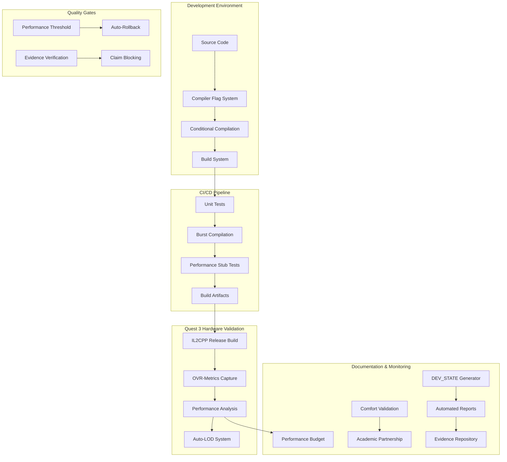

# Design Document - Do-It-Right Recovery Phase 0-1

## Overview

This design implements a comprehensive evidence-based development framework that transforms our XR Bubble Library from an aspirational prototype into a rigorously validated system. The architecture prioritizes measurable performance on Quest 3 hardware, automated quality gates, and transparent documentation of all claims. The system is designed around four core principles: evidence before rhetoric, one moving part at a time, fail-fast gates in CI, and hardware-driven truth.

## Architecture

### High-Level System Architecture



### Component Interaction Flow

The system operates through a series of interconnected validation layers:

1. **Development Layer**: Compiler flags control feature availability
2. **Build Layer**: CI gates prevent regression introduction
3. **Hardware Layer**: Quest 3 validation provides ground truth
4. **Documentation Layer**: Automated evidence generation supports all claims
5. **Quality Layer**: Automatic rollback prevents performance degradation

## Components and Interfaces

### 1. Compiler Flag Management System

**Purpose**: Control experimental feature compilation and ensure only validated features are included in builds.

**Core Components**:

- `CompilerFlagManager.cs`: Central management of all experimental flags
- `FeatureGateAttribute.cs`: Attribute-based feature gating for runtime checks
- `BuildConfigurationValidator.cs`: Validates flag consistency across build configurations

**Interface Design**:

```csharp
public interface ICompilerFlagManager
{
    bool IsFeatureEnabled(ExperimentalFeature feature);
    void SetFeatureState(ExperimentalFeature feature, bool enabled);
    Dictionary<ExperimentalFeature, bool> GetAllFeatureStates();
    void ValidateConfiguration();
}

public enum ExperimentalFeature
{
    AI_INTEGRATION,
    VOICE_PROCESSING,
    ADVANCED_WAVE_ALGORITHMS,
    CLOUD_INFERENCE,
    ON_DEVICE_ML
}
```

**Implementation Strategy**:

- Use Unity's scripting define symbols for compile-time exclusion
- Implement runtime feature gates for additional safety
- Provide editor tools for easy flag management during development
- Ensure flag states are preserved across Unity sessions and builds

### 2. Development State Documentation System

**Purpose**: Automatically generate comprehensive documentation of system state, module status, and validation evidence.

**Core Components**:

- `DevStateGenerator.cs`: Reflection-based analysis of assembly definitions
- `ModuleStatusAnalyzer.cs`: Determines implementation status of each module
- `EvidenceCollector.cs`: Gathers supporting evidence for each claim
- `ReportFormatter.cs`: Generates markdown documentation with proper formatting

**Interface Design**:

```csharp
public interface IDevStateGenerator
{
    DevStateReport GenerateReport();
    void ScheduleNightlyGeneration();
    bool ValidateReportAccuracy();
}

public class DevStateReport
{
    public DateTime GeneratedAt { get; set; }
    public string BuildVersion { get; set; }
    public List<ModuleStatus> Modules { get; set; }
    public PerformanceMetrics CurrentPerformance { get; set; }
    public List<EvidenceFile> SupportingEvidence { get; set; }
}

public enum ModuleState
{
    Implemented,    // Fully functional with evidence
    Disabled,       // Compiled out via flags
    Conceptual      // Exists but not validated
}
```

### 3. CI/CD Performance Gate System

**Purpose**: Implement automated quality gates that prevent performance regressions and maintain build quality.

**Core Components**:

- `PerformanceGateRunner.cs`: Orchestrates all performance validation
- `UnityProfilerIntegration.cs`: Interfaces with Unity's profiler for automated testing
- `BurstCompilationValidator.cs`: Ensures Burst compilation succeeds
- `PerformanceThresholdManager.cs`: Manages and enforces performance budgets

**Interface Design**:

```csharp
public interface IPerformanceGateRunner
{
    GateResult RunAllGates();
    GateResult RunSpecificGate(PerformanceGate gate);
    void UpdateThresholds(PerformanceThresholds thresholds);
    List<GateResult> GetHistoricalResults(TimeSpan period);
}

public class PerformanceThresholds
{
    public float MinimumFPS { get; set; } = 60f;
    public float MaximumFrameTime { get; set; } = 16.67f; // 60 FPS
    public long MaximumMemoryUsage { get; set; }
    public float MaximumCPUUsage { get; set; }
}
```

### 4. Quest 3 Hardware Validation System

**Purpose**: Provide accurate, hardware-specific performance validation using OVR-Metrics and IL2CPP builds.

**Core Components**:

- `Quest3PerformanceValidator.cs`: Orchestrates hardware-specific testing
- `OVRMetricsIntegration.cs`: Interfaces with Oculus performance tools
- `IL2CPPBuildManager.cs`: Manages release build generation and testing
- `AutoLODController.cs`: Automatically adjusts quality to maintain performance

**Interface Design**:

```csharp
public interface IQuest3PerformanceValidator
{
    Task<PerformanceReport> RunValidation(ValidationConfig config);
    Task<bool> ValidateFrameRate(float targetFPS, TimeSpan duration);
    Task<LODRecommendation> CalculateOptimalLOD();
    void StartContinuousMonitoring();
}

public class ValidationConfig
{
    public int BubbleCount { get; set; } = 100;
    public float TargetFPS { get; set; } = 72f;
    public TimeSpan TestDuration { get; set; } = TimeSpan.FromSeconds(60);
    public bool EnableAutoLOD { get; set; } = true;
}
```

### 5. Wave Mathematics Core System

**Purpose**: Implement and validate the core wave mathematics that drives bubble behavior and positioning.

**Core Components**:

- `WaveMatrixCore.cs`: Core mathematical algorithms for wave generation
- `BubblePositionCalculator.cs`: Calculates bubble positions based on wave mathematics
- `PerformanceOptimizedWaveSystem.cs`: Optimized implementation for Quest 3
- `WaveParameterValidator.cs`: Validates wave parameters for stability and performance

**Interface Design**:

```csharp
public interface IWaveMatrixCore
{
    Vector3[] CalculateBubblePositions(int bubbleCount, WaveParameters parameters);
    void UpdateWaveState(float deltaTime);
    bool ValidateParameters(WaveParameters parameters);
    PerformanceMetrics GetPerformanceMetrics();
}

public class WaveParameters
{
    public float Frequency { get; set; }
    public float Amplitude { get; set; }
    public Vector3 WaveDirection { get; set; }
    public float PhaseOffset { get; set; }
    public AnimationCurve BreathingCurve { get; set; }
}
```

### 6. Automated Performance Monitoring System

**Purpose**: Continuously monitor system performance and trigger automatic rollbacks when thresholds are exceeded.

**Core Components**:

- `ContinuousPerformanceMonitor.cs`: Real-time performance tracking
- `AutoRollbackSystem.cs`: Automatic reversion to last known good state
- `PerformanceAlertManager.cs`: Notification system for performance issues
- `PerformanceTrendAnalyzer.cs`: Long-term performance trend analysis

## Data Models

### Performance Data Model

```csharp
public class PerformanceMetrics
{
    public float AverageFPS { get; set; }
    public float MinimumFPS { get; set; }
    public float MaximumFPS { get; set; }
    public float AverageFrameTime { get; set; }
    public long MemoryUsage { get; set; }
    public float CPUUsage { get; set; }
    public float GPUUsage { get; set; }
    public float ThermalState { get; set; }
    public DateTime CapturedAt { get; set; }
    public string BuildVersion { get; set; }
    public Dictionary<string, object> AdditionalMetrics { get; set; }
}
```

### Evidence Data Model

```csharp
public class EvidenceFile
{
    public string FileName { get; set; }
    public string FilePath { get; set; }
    public string SHA256Hash { get; set; }
    public DateTime CreatedAt { get; set; }
    public string ClaimSupported { get; set; }
    public EvidenceType Type { get; set; }
    public Dictionary<string, string> Metadata { get; set; }
}

public enum EvidenceType
{
    PerformanceLog,
    Screenshot,
    VideoCapture,
    ProfilerData,
    TestResults,
    UserStudyData
}
```

### Module Status Data Model

```csharp
public class ModuleStatus
{
    public string ModuleName { get; set; }
    public string AssemblyPath { get; set; }
    public ModuleState State { get; set; }
    public List<string> Dependencies { get; set; }
    public PerformanceMetrics Performance { get; set; }
    public List<EvidenceFile> Evidence { get; set; }
    public DateTime LastValidated { get; set; }
    public string ValidationNotes { get; set; }
}
```

## Error Handling

### Comprehensive Error Handling Strategy

**1. Performance Threshold Violations**

- Automatic LOD reduction when FPS drops below target
- Graceful degradation of visual quality to maintain performance
- Detailed logging of performance violation circumstances
- Automatic rollback to last known good configuration

**2. Hardware Validation Failures**

- Fallback to editor-based testing when Quest 3 unavailable
- Clear error messages indicating hardware dependency
- Automatic retry mechanisms for transient hardware issues
- Comprehensive logging of hardware-specific errors

**3. Compilation and Build Failures**

- Detailed error reporting for compiler flag conflicts
- Automatic flag validation before build attempts
- Clear guidance for resolving compilation issues
- Rollback to working flag configurations

**4. Evidence Generation Failures**

- Retry mechanisms for evidence collection
- Fallback evidence sources when primary collection fails
- Clear indication when claims lack supporting evidence
- Automatic blocking of unsupported claims

### Error Recovery Mechanisms

```csharp
public interface IErrorRecoveryManager
{
    Task<RecoveryResult> AttemptRecovery(SystemError error);
    void RegisterRecoveryStrategy(Type errorType, IRecoveryStrategy strategy);
    List<RecoveryAttempt> GetRecoveryHistory();
}

public class RecoveryResult
{
    public bool Success { get; set; }
    public string RecoveryAction { get; set; }
    public TimeSpan RecoveryTime { get; set; }
    public List<string> AdditionalSteps { get; set; }
}
```

## Testing Strategy

### Multi-Layer Testing Approach

**1. Unit Testing Layer**

- Comprehensive unit tests for all core mathematical functions
- Mock-based testing for hardware-dependent components
- Property-based testing for wave mathematics validation
- Performance unit tests with strict timing requirements

**2. Integration Testing Layer**

- End-to-end testing of compiler flag systems
- CI pipeline integration testing
- Hardware integration testing on Quest 3
- Performance integration testing across system boundaries

**3. Hardware Validation Layer**

- Automated Quest 3 performance testing
- Long-duration stability testing
- Thermal performance validation
- User comfort validation studies

**4. Evidence Validation Layer**

- Automated verification of evidence file integrity
- Cross-validation of performance claims against evidence
- Audit trail validation for all generated reports
- External review validation processes

### Testing Infrastructure

```csharp
public interface ITestingInfrastructure
{
    Task<TestResult> RunTestSuite(TestSuite suite);
    Task<PerformanceTestResult> RunPerformanceTests(PerformanceTestConfig config);
    Task<HardwareTestResult> RunHardwareValidation(HardwareTestConfig config);
    void ScheduleAutomatedTesting(TestSchedule schedule);
}

public class TestResult
{
    public bool Passed { get; set; }
    public TimeSpan Duration { get; set; }
    public List<TestCase> TestCases { get; set; }
    public string DetailedReport { get; set; }
    public List<EvidenceFile> GeneratedEvidence { get; set; }
}
```

### Continuous Testing Strategy

- **Commit-triggered testing**: Every commit triggers basic performance validation
- **Nightly comprehensive testing**: Full hardware validation runs nightly
- **Weekly stability testing**: Extended duration testing for stability validation
- **Monthly external validation**: Third-party validation of performance claims

This design ensures that every aspect of our system is measurable, validated, and backed by concrete evidence from Quest 3 hardware testing. The architecture supports our "do-it-right" philosophy by making it impossible to make unsubstantiated claims and ensuring that performance regressions are caught immediately.
