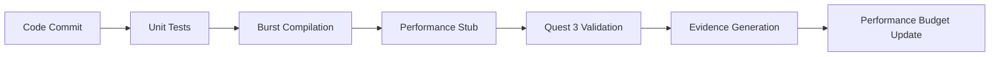

# DO-IT-RIGHT RECOVERY PHASE 0-1 IMPLEMENTATION KICKOFF
**Date:** February 13, 2025  
**Meeting Type:** Emergency Strategic Implementation Session  
**Committee:** Full Technical Committee + CEO Oversight  
**Priority:** CRITICAL - Company Recovery Initiative

## EXECUTIVE SUMMARY

We are implementing the comprehensive "do-it-right" recovery strategy Phase 0-1 as defined in our CEO briefing. This represents a fundamental shift from aspirational development to evidence-based validation. Every line of code, every performance claim, and every feature must be backed by measurable Quest 3 hardware data before it can be considered "implemented."

## STRATEGIC CONTEXT

### The Four Guiding Principles
1. **Evidence before rhetoric** - All public-facing claims come after logs, screenshots, or papers
2. **One moving part at a time** - Complexity explodes combinatorially; lock each layer before stacking another
3. **Fail-fast gates in CI** - Automated perf + lint + claim-evidence checks stop regressions immediately
4. **Hardware-driven truth** - Quest 3 metrics trump white-board budgets every time

### Phase 0-1 Objectives
- **Phase 0**: Code hygiene with compiler flags, automated documentation, CI gates
- **Phase 1**: Prove 100-bubble scene at 72Hz on Quest 3 with comprehensive evidence

## IMPLEMENTATION SPECIFICATION

### Complete Spec Location
- **Requirements**: `.kiro/specs/do-it-right-recovery-phase0-1/requirements.md`
- **Design**: `.kiro/specs/do-it-right-recovery-phase0-1/design.md`
- **Tasks**: `.kiro/specs/do-it-right-recovery-phase0-1/tasks.md`

### Key Deliverables Overview

#### Phase 0: Code Hygiene (Immediate Priority)
1. **Compiler Flag System**: Wrap all AI/voice code in `#if EXP_AI ... #endif` (default off)
2. **DEV_STATE.md**: Auto-generated nightly from *.asmdef + reflection
3. **README Banner**: "⚠️ AI & voice features are disabled until validated on Quest 3"
4. **CI Gates**: Unit tests, Burst compile, perf stub (fail if median FPS <60)

#### Phase 1: Wave Mathematics Validation (Core Foundation)
1. **100-Bubble Demo**: Exactly 100 bubbles at 72Hz on Quest 3
2. **OVR-Metrics Integration**: 60-second capture sessions with CSV auto-parsing
3. **Auto-LOD System**: Reduce bubble count if FPS drops below 72Hz
4. **Performance Budget**: Frame-time pie chart with 30% headroom rule
5. **Comfort Validation**: SIM/SSQ study (n=12) with HCI lab partnership

## COMMITTEE ASSIGNMENTS AND RESPONSIBILITIES

### Technical Architecture Committee
**Lead**: Dr. Chen (Technical Architecture)  
**Responsibility**: Core system design and integration oversight

**Primary Tasks**:
- Task 1: Implement Compiler Flag Management System
- Task 5: Implement CI/CD Performance Gate System  
- Task 13: Complete System Integration and Validation

**Success Criteria**:
- All experimental features properly gated behind compiler flags
- CI pipeline blocks all performance regressions
- Complete system integration with evidence validation

### Performance Engineering Committee  
**Lead**: Performance Engineering Specialist  
**Responsibility**: Quest 3 hardware validation and performance optimization

**Primary Tasks**:
- Task 6: Implement Core Wave Mathematics System
- Task 8: Implement Quest 3 Performance Validation System
- Task 9: Implement Performance Budget Documentation System

**Success Criteria**:
- 100-bubble scene maintains 72Hz on Quest 3 hardware
- Comprehensive performance budgets with 30% headroom
- Automated LOD system prevents performance degradation

### Quality Assurance Committee
**Lead**: QA Engineering Lead  
**Responsibility**: Testing infrastructure and evidence validation

**Primary Tasks**:
- Task 3: Implement Development State Documentation System
- Task 11: Implement Automated Performance Monitoring System
- Task 12: Implement Evidence-Based Development System

**Success Criteria**:
- Automated DEV_STATE.md generation with 100% accuracy
- Performance monitoring with automatic rollback capability
- Complete evidence collection for all performance claims

### User Experience Committee
**Lead**: UX Research Specialist  
**Responsibility**: Comfort validation and user safety

**Primary Tasks**:
- Task 10: Implement User Comfort Validation Protocol
- Task 7: Create 100-Bubble Demo Scene (UX aspects)

**Success Criteria**:
- SIM/SSQ study protocol approved by HCI lab IRB
- Comfort validation data collection system operational
- Wave parameters validated for user comfort and safety

## TECHNICAL IMPLEMENTATION DETAILS

### Compiler Flag Architecture
```csharp
public enum ExperimentalFeature
{
    AI_INTEGRATION,      // #if EXP_AI
    VOICE_PROCESSING,    // #if EXP_VOICE  
    ADVANCED_WAVE_ALGORITHMS,
    CLOUD_INFERENCE,
    ON_DEVICE_ML
}
```

### Performance Validation Pipeline


### Evidence Collection System
- **Performance Logs**: OVR-Metrics CSV data with SHA256 hashes
- **Screenshots**: Automated capture during testing
- **Profiler Data**: Unity profiler exports for analysis
- **Test Results**: Comprehensive test suite results
- **User Study Data**: SIM/SSQ comfort validation results

## CRITICAL SUCCESS FACTORS

### Immediate Blockers to Resolve
1. **Quest 3 Hardware Availability**: Confirm Quest 3 order and delivery timeline
2. **HCI Lab Partnership**: Establish academic partnership for comfort validation
3. **OVR-Metrics Integration**: Ensure Oculus development tools are properly configured
4. **CI Infrastructure**: Set up automated testing pipeline with performance gates

### Risk Mitigation Strategies
1. **Hardware Dependency**: Implement editor-based fallback testing while awaiting Quest 3
2. **Academic Partnership Delays**: Begin comfort study design while establishing partnerships
3. **Performance Regression**: Implement automatic rollback before any performance issues
4. **Evidence Collection Failures**: Multiple evidence sources with fallback mechanisms

## COMMITTEE EXECUTION PROTOCOL

### Daily Standup Structure
- **Morning**: Progress on assigned tasks with specific metrics
- **Afternoon**: Blocker resolution and cross-committee coordination
- **Evening**: Evidence validation and documentation updates

### Weekly Review Cycle
- **Monday**: Task assignment and priority setting
- **Wednesday**: Mid-week progress review and course correction
- **Friday**: Weekly deliverable validation and next week planning

### Success Metrics and Gates
- **Code Quality**: 100% unit test coverage, zero compilation warnings
- **Performance**: Consistent 72Hz on Quest 3 with evidence files
- **Documentation**: Automated DEV_STATE.md with complete accuracy
- **Evidence**: Every performance claim backed by verifiable data

## IMMEDIATE NEXT STEPS (TODAY)

### Priority 1: Code Hygiene Foundation
1. **Merge compiler-flag infrastructure** (Task 1.1)
2. **Generate first DEV_STATE.md** (Task 3.1)  
3. **Push CI perf stub** (Task 5.2)
4. **Update README banner** (Task 4.1)

### Priority 2: Hardware Preparation
1. **Confirm Quest 3 order status**
2. **Set up OVR-Metrics integration**
3. **Prepare IL2CPP build pipeline**
4. **Establish performance baseline**

### Priority 3: Academic Partnership
1. **Contact HCI labs for comfort validation partnership**
2. **Draft SIM/SSQ study protocol**
3. **Prepare IRB submission materials**
4. **Establish data sharing agreements**

## COMMITTEE COMMITMENT

Each committee member commits to:
- **Evidence-first development**: No claims without supporting data
- **Hardware-driven validation**: Quest 3 metrics as ground truth
- **Transparent documentation**: Complete audit trail for all decisions
- **Fail-fast mentality**: Immediate rollback on performance regression

## SUCCESS DEFINITION

Phase 0-1 is complete when:
1. **100-bubble scene runs at 72Hz on Quest 3** with OVR-Metrics evidence
2. **All experimental features are properly gated** behind compiler flags
3. **Automated CI pipeline prevents all regressions** with performance gates
4. **Complete evidence package exists** for every performance claim
5. **Comfort validation protocol is operational** with academic partnership

This represents our commitment to rebuilding credibility through measurable results rather than aspirational promises. Every task, every metric, and every claim will be backed by Quest 3 hardware data and rigorous validation.

**Meeting Adjourned**: Ready to begin implementation with full committee commitment to evidence-based development.