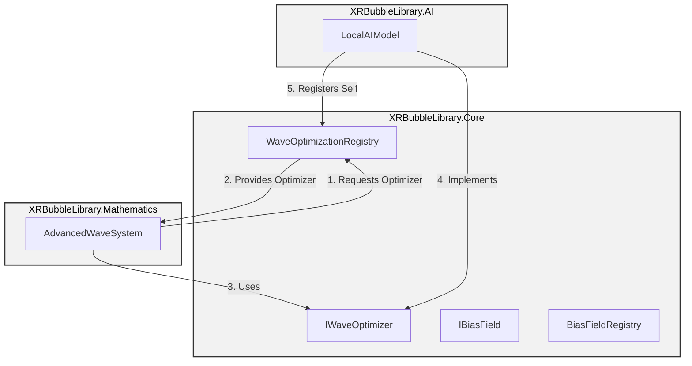

# XRBubbleLibrary Architecture

This document outlines the software architecture of the XRBubbleLibrary, with a focus on the dependency inversion pattern implemented to resolve circular dependencies between the AI and Mathematics assemblies.

## Assembly Dependencies

The library is structured into three key assemblies:

*   **XRBubbleLibrary.Core:** A foundational assembly containing interfaces and service registries. It has no dependencies on other project assemblies.
*   **XRBubbleLibrary.Mathematics:** Contains the core wave generation and manipulation logic. It depends on `XRBubbleLibrary.Core` to access AI-driven optimization services.
*   **XRBubbleLibrary.AI:** Contains the local AI model and related services for optimizing bubble positions. It depends on `XRBubbleLibrary.Core` to provide its services to other assemblies.

This architecture creates a clear, directed acyclic graph of dependencies, preventing circular references and promoting a modular, testable, and extensible codebase.

### Dependency Graph

## Dependency Inversion Pattern

The dependency inversion pattern is implemented through the following components:

*   **Interfaces:** The `IWaveOptimizer` and `IBiasFieldProvider` interfaces in the `Core` assembly define the contracts for AI services.
*   **Registries:** The `WaveOptimizationRegistry` and `BiasFieldRegistry` classes in the `Core` assembly act as service locators, allowing the `Mathematics` assembly to retrieve implementations of the AI service interfaces without a direct dependency on the `AI` assembly.
*   **Implementation:** The `LocalAIModel` in the `AI` assembly implements the `IWaveOptimizer` and `IBiasFieldProvider` interfaces and registers itself with the registries on startup.

This pattern ensures that high-level modules (like `Mathematics`) do not depend on low-level modules (like `AI`), but that both depend on abstractions (`Core`).